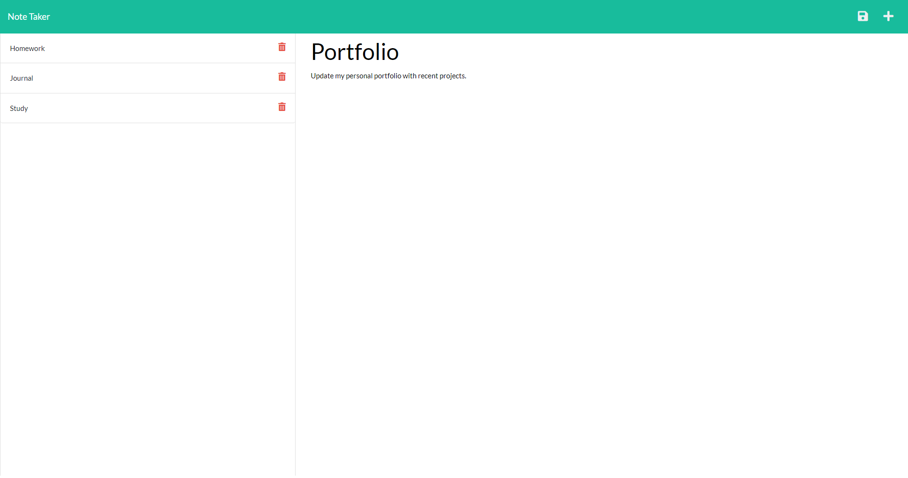

# Express.js Challenge: Note Taker
[](https://bootcamp.msu.edu/)


## Technologies


## Description
Created an application called Note Taker that allows user to write and save notes. The application will use [Express.js](https://www.npmjs.com/package/express) as the back end and will save and retrieve the note data from a JSON file. The application will be deployed on Heroku. The application can be invoked with the following command if running on your local machine:
```
npm start
```
## Installation
***Requirments***

[Node.js](https://nodejs.org/en/) | [Express.js](https://www.npmjs.com/package/express)

***Once Installed:***
1. Clone the Repository on to your machine.
2. Open the terminal and ensure you are in the right file path.
3. Run the command ```npm install``` to download the packages.
4. Then run the command ```npm start``` to run the software.
5. Then open the website on your local server

## User Story
```
AS A small business owner
I WANT to be able to write and save notes
SO THAT I can organize my thoughts and keep track of tasks I need to complete
```

## Acceptance Criteria
```
GIVEN a note-taking application
WHEN I open the Note Taker
THEN I am presented with a landing page with a link to a notes page
WHEN I click on the link to the notes page
THEN I am presented with a page with existing notes listed in the left-hand column, plus empty fields to enter a new note title and the note’s text in the right-hand column
WHEN I enter a new note title and the note’s text
THEN a Save icon appears in the navigation at the top of the page
WHEN I click on the Save icon
THEN the new note I have entered is saved and appears in the left-hand column with the other existing notes
WHEN I click on an existing note in the list in the left-hand column
THEN that note appears in the right-hand column
WHEN I click on the Write icon in the navigation at the top of the page
THEN I am presented with empty fields to enter a new note title and the note’s text in the right-hand column
```

## Screenshot
This is the start of the application:

This is when adding a note:

This is when you look over a note written:


## Link
A link to the [code](https://github.com/jgarcia45/note-taker):
```
https://github.com/jgarcia45/note-taker
```
A link to the deployed [URL](https://shielded-depths-21814.herokuapp.com/):
```
https://shielded-depths-21814.herokuapp.com/
```

## License
  Copyright (c) Juan Garcia. All rights reserved.
  
  Licensed under the [MIT](LICENSE) license.